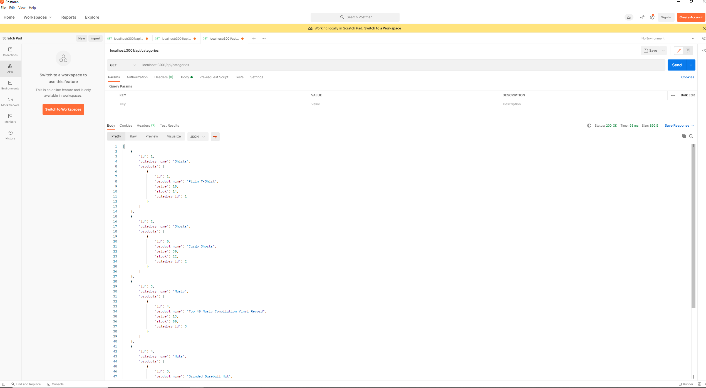

# E-commerce API using ORM [](https://opensource.org/licenses/MIT)

## Description
This is a back-end application to create RESTFul API routes for an E-commerce site using Sequalize, mysql and express.js. 

## Built With
JavaScript, ES6, Node.js (express.js, mysql2, sequelize, nodemon, dotenv).

## Table of Contents
* [User-Story](#User-Story)
* [Acceptance-Criteria](#Acceptance-Criteria)
* [Installation](#Installation)
* [Usage](#Usage)
* [License](#License)
* [Contributing](#Contributing)
* [Tests](#Tests)
* [Screenshot](#Screenshot)
* [Questions](#Questions)

### User-Story
AS A manager at an internet retail company
I WANT a back end for my e-commerce website that uses the latest technologies
SO THAT my company can compete with other e-commerce companies

### Acceptance-Criteria
GIVEN a functional Express.js API
WHEN I add my database name, MySQL username, and MySQL password to an environment variable file
THEN I am able to connect to a database using Sequelize
WHEN I enter schema and seed commands
THEN a development database is created and is seeded with test data
WHEN I enter the command to invoke the application
THEN my server is started and the Sequelize models are synced to the MySQL database
WHEN I open API GET routes in Insomnia Core for categories, products, or tags
THEN the data for each of these routes is displayed in a formatted JSON
WHEN I test API POST, PUT, and DELETE routes in Insomnia Core
THEN I am able to successfully create, update, and delete data in my database
### Installation
To download the application, use 
```git clone https://github.com/vsjanarthani/E-commerce-ORM.git```. 
Inorder to install the necessary dependencies run 
```npm install``` 
in your terminal. 

### Usage
After installing all the dependencies, set up the .env file with the username, password and database name. Then, enter 
```npm start``` 
to check if the server is running without any error. If it runs then enter
```npm run seed``` 
in your terminal to run the seed. For a walkthrough demo click here [!Demo](https://drive.google.com/file/d/1TGY48-3jJEzJCVjQ_0HrmVJVoyCzF-6p/view?usp=sharing).

### License
This application is covered under the following license. 

**MIT**

### Contributing 
No contributions at the moment. If anyone wishes to provide contributions, please contact the author.

### Tests
No automated test is set up for this application. To test the API routes, use Postman or insomnia core.

### Screenshot

### Questions
If you have any questions, please reach out to the<br>
Author: Janarthani V S <br>
Email 📧: janarthani.vs@gmail.com <br>
Author's github profile: [GitHub](https://github.com/vsjanarthani)
